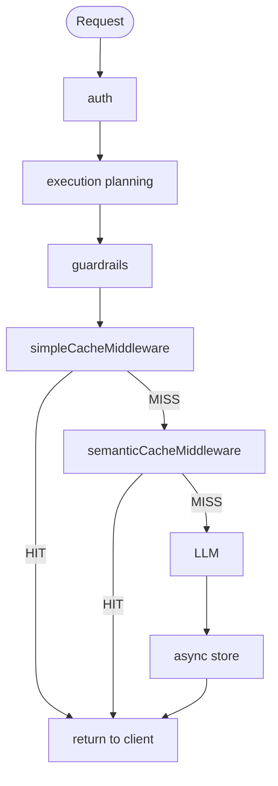

# ADR-0006: Semantic Response Cache

## Status

Accepted

## Context

GOModel already has an exact-match response cache (`simpleCacheMiddleware`) that hashes the full request body and returns a stored response on byte-identical requests. This covers trivial cases but misses semantically equivalent requests with different phrasing:

- "What's the capital of France?" vs. "Which city is France's capital?"
- "Explain quantum entanglement simply" vs. "ELI5 quantum entanglement"

Production benchmarks from similar systems show exact-match hit rates ~18%, while semantic caching reaches ~60–70% in high-repetition workloads — a significant reduction in LLM API costs and latency.

A second-layer semantic cache is needed to recognize meaning-equivalent queries without upstream LLM calls.

## Decision

### Layer Position & Ordering

Semantic caching runs as a **second layer behind exact-match caching**.  
Exact-match (sub-ms) always runs first; semantic (~50–100 ms including embedding) only on miss.

**Important**: both cache layers must execute **after** guardrail/ExecutionPlan patching, so they see the final prompt sent to the LLM.  
Current global middleware placement runs too early and can bypass guardrails — this is fixed by moving cache checks into the translated inference handlers (post-`PatchChatRequest`).

Exact layer: `simpleCacheMiddleware` (byte-identical body, SHA-256). Semantic layer: `semanticCacheMiddleware` (vector KNN). On exact **HIT**, respond with `X-Cache: HIT exact`; on semantic **HIT**, `X-Cache: HIT semantic`. On full miss, the handler forwards to the LLM, stores exact + semantic entries, then returns.

### Embedding

Unified `Embedder` interface with two implementations:

- `**MiniLMEmbedder`** (default): local `all-MiniLM-L6-v2` via ONNX Runtime (384-dim, zero external dependency). Activated when `embedder.provider` is `"local"` or absent.
- `**APIEmbedder**`: calls `POST /v1/embeddings` on any configured OpenAI-compatible provider, reusing existing `api_key` + `base_url`. Activated when `embedder.provider` matches a named provider. Unknown provider → startup error.

Local default is a key differentiator vs. Bifrost/LiteLLM.

### Vector Store

`VecStore` interface + `Type`-switched factory (mirrors `StorageConfig`):

| Type                   | Notes                                       |
| ---------------------- | ------------------------------------------- |
| `sqlite-vec`(default) | Embedded, CGO-free, file-based. Zero infra. |
| `qdrant`               | External Qdrant (first external backend)    |
| `pgvector`             | For PostgreSQL users                        |

TTL implemented via `expires_at` timestamp + read-time filter + background cleanup (1h default interval).

### Text Extraction

- Embed the **last user message** (GPTCache-style default — pragmatic hit-rate/accuracy trade-off).  
- If `exclude_system_prompt: true`, strip system messages before count & embedding (avoids noise from identical system prompts).  
- Full conversation embedding rejected (noisy vectors, poor scaling on long threads).

### Parameter Isolation (`params_hash`)

SHA-256 of output-shaping parameters including `model`, `temperature`, `top_p`, `max_tokens`, `tools` (hashed), `response_format`, `stream`, and `endpoint_type` (for endpoint safety).  
All KNN searches filter by this hash → prevents serving wrong-format / wrong-parameter responses.

**Future extension**: append `guardrails_hash` (or `execution_plan_hash`) once guardrails exist. Schema already supports it.

### Conversation History Threshold

Skip semantic caching when non-system messages > `max_conversation_messages` (default: 3).  
Long multi-turn sessions have near-zero hit rates and high false-positive risk. Exact-match still applies.

### Similarity Threshold

**Default: 0.92** (0.90–0.95 consensus range).  
Start here; tune down only after monitoring false positives (higher = safer, lower = more hits).  
Bifrost's 0.80 is too aggressive for correctness-sensitive use cases.

### Per-Request Overrides

- `X-Cache-Semantic-Threshold`  
- `X-Cache-TTL`  
- `X-Cache-Type`: `exact` | `semantic` | `both` (default)  
- `X-Cache-Control: no-store`

### What is Explicitly Not Implemented (v1)

- Streaming caching (skipped entirely — phase-2: chunk array storage + replay)  
- Guardrails / ExecutionPlan hash computation (reserved in design)  
- Cross-endpoint normalization (`/chat/completions` vs `/responses` vs pass-through) — `endpoint_type` in `params_hash` for safety → Future optimization: canonical response renderer to enable sharing  
- Cache warming, manual purge, advanced eviction  
- Prometheus metrics / observability (deferred — basic structured logging sufficient for v1)

## Consequences

### Positive

- Expected 60–70% semantic hit rates in support/FAQ/classification workloads  
- Zero extra infrastructure in default mode  
- Strong correctness guarantees via parameter isolation & high threshold  
- Reuses existing provider credentials for API embedding  
- Swappable backends via interfaces

### Negative / Mitigations

- ~50–100 ms added latency on semantic miss (acceptable vs LLM latency)  
- Requires `libonnxruntime` at runtime for local embedding (documented in deployment guide)  
- False positives possible → mitigated by high default threshold + sampling of semantic hits  
- No benefit for creative, real-time, or personalized traffic → use `no-store` header  
- No observability yet → add structured logs for semantic hits/misses in v1

## Alternatives Considered

- Redis/RediSearch as default → rejected (external dep vs sqlite-vec zero-infra)  
- Embed full conversation → rejected (noisy, expensive, low hit rate)  
- Single cache store for exact + semantic → rejected (different needs & scaling)  
- Always require external embedding API → rejected (circular dep risk, breaks zero-infra)

