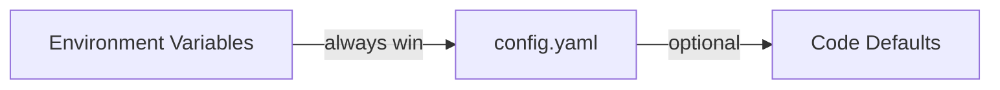

## Good defaults

GOModel uses a good defaults philosophy. This means that the default settings should be enough to use it.

## How to override the default settings?

We use a three-layer configuration pipeline. Every setting has a sensible default, so you can start the server with zero configuration.

{/* Environment Variables (always win) → config.yaml (optional) → Code Defaults */}



<Tip>
  As GOModel works out of the box with no configuration files, you can try it in
  a minute.

TODO: the link to the quick start should be provided here!

</Tip>

GOModel automatically discovers providers from well-known environment variables.

## Configuration Methods

### 1. Environment Variables

The most common way to configure GOModel. Set any of the variables below to override defaults.

#### Server

| Variable             | Description                                           | Default                |
| -------------------- | ----------------------------------------------------- | ---------------------- |
| `PORT`               | HTTP server port                                      | `8080`                 |
| `GOMODEL_MASTER_KEY` | Authentication key for securing the gateway           | _(empty, unsafe mode)_ |
| `BODY_SIZE_LIMIT`    | Max request body size (e.g., `10M`, `1024K`, `500KB`) | _(no limit)_           |

#### Cache

| Variable            | Description                       | Default          |
| ------------------- | --------------------------------- | ---------------- |
| `CACHE_TYPE`        | Cache backend: `local` or `redis` | `local`          |
| `GOMODEL_CACHE_DIR` | Directory for local cache files   | `.cache`         |
| `REDIS_URL`         | Redis connection URL              | _(empty)_        |
| `REDIS_KEY`         | Redis key for model cache         | `gomodel:models` |
| `REDIS_TTL`         | Cache TTL in seconds              | `86400` (24h)    |

#### Storage

Storage is shared by audit logging, usage tracking, and future features like IAM.

| Variable             | Description                                   | Default           |
| -------------------- | --------------------------------------------- | ----------------- |
| `STORAGE_TYPE`       | Backend: `sqlite`, `postgresql`, or `mongodb` | `sqlite`          |
| `SQLITE_PATH`        | SQLite database file path                     | `data/gomodel.db` |
| `POSTGRES_URL`       | PostgreSQL connection string                  | _(empty)_         |
| `POSTGRES_MAX_CONNS` | PostgreSQL connection pool size               | `10`              |
| `MONGODB_URL`        | MongoDB connection string                     | _(empty)_         |
| `MONGODB_DATABASE`   | MongoDB database name                         | `gomodel`         |

#### Audit Logging

| Variable                          | Description                                | Default |
| --------------------------------- | ------------------------------------------ | ------- |
| `LOGGING_ENABLED`                 | Enable audit logging                       | `false` |
| `LOGGING_LOG_BODIES`              | Log request/response bodies                | `true`  |
| `LOGGING_LOG_HEADERS`             | Log headers (sensitive ones auto-redacted) | `true`  |
| `LOGGING_ONLY_MODEL_INTERACTIONS` | Only log AI model endpoints                | `true`  |
| `LOGGING_BUFFER_SIZE`             | In-memory buffer before flush              | `1000`  |
| `LOGGING_FLUSH_INTERVAL`          | Flush interval in seconds                  | `5`     |
| `LOGGING_RETENTION_DAYS`          | Auto-delete after N days (0 = forever)     | `30`    |

<Warning>
  When `LOGGING_LOG_BODIES` is enabled, request and response bodies are stored
  in full. These may contain sensitive data such as PII or API keys embedded in
  prompts.
</Warning>

#### Token Usage Tracking

| Variable                       | Description                                    | Default |
| ------------------------------ | ---------------------------------------------- | ------- |
| `USAGE_ENABLED`                | Enable token usage tracking                    | `true`  |
| `ENFORCE_RETURNING_USAGE_DATA` | Auto-add `include_usage` to streaming requests | `true`  |
| `USAGE_BUFFER_SIZE`            | In-memory buffer before flush                  | `1000`  |
| `USAGE_FLUSH_INTERVAL`         | Flush interval in seconds                      | `5`     |
| `USAGE_RETENTION_DAYS`         | Auto-delete after N days (0 = forever)         | `90`    |

#### Metrics

| Variable           | Description               | Default    |
| ------------------ | ------------------------- | ---------- |
| `METRICS_ENABLED`  | Enable Prometheus metrics | `false`    |
| `METRICS_ENDPOINT` | HTTP path for metrics     | `/metrics` |

#### Admin

| Variable                  | Description                   | Default |
| ------------------------- | ----------------------------- | ------- |
| `ADMIN_ENDPOINTS_ENABLED` | Enable the admin REST API     | `true`  |
| `ADMIN_UI_ENABLED`        | Enable the admin dashboard UI | `true`  |

#### HTTP Client

These control timeouts for upstream API requests to LLM providers.

| Variable                       | Description                                  | Default        |
| ------------------------------ | -------------------------------------------- | -------------- |
| `HTTP_TIMEOUT`                 | Overall request timeout in seconds           | `600` (10 min) |
| `HTTP_RESPONSE_HEADER_TIMEOUT` | Time to wait for response headers in seconds | `600` (10 min) |

#### Provider API Keys

Set these to automatically register providers. No YAML configuration required.

| Variable            | Provider                   |
| ------------------- | -------------------------- |
| `OPENAI_API_KEY`    | OpenAI                     |
| `ANTHROPIC_API_KEY` | Anthropic                  |
| `GEMINI_API_KEY`    | Google Gemini              |
| `XAI_API_KEY`       | xAI (Grok)                 |
| `GROQ_API_KEY`      | Groq                       |
| `OLLAMA_BASE_URL`   | Ollama (no API key needed) |

You can also set a custom base URL for any provider using `<PROVIDER>_BASE_URL` (e.g., `OPENAI_BASE_URL`).

### 2. `.env` File

GOModel automatically loads a `.env` file from the working directory at startup. This is convenient for local development.

```bash
# .env
PORT=3000
OPENAI_API_KEY=sk-...
ANTHROPIC_API_KEY=sk-ant-...
```

Copy `.env.template` to `.env` and uncomment the values you need:

```bash
cp .env.template .env
```

<Note>
  Real environment variables always override values from the `.env` file. The
  `.env` file is only loaded if it exists — missing it is not an error.
</Note>

### 3. Configuration File (YAML)

For more complex setups, you can use an optional YAML configuration file. GOModel looks for it in two locations (in order):

1. `config/config.yaml`
2. `config.yaml`

To get started, copy the example:

```bash
cp config/config.example.yaml config/config.yaml
```

Then uncomment and edit the settings you want to change:

```yaml
server:
  port: "3000"
  master_key: "my-secret-key"

cache:
  type: redis
  redis:
    url: "redis://my-redis:6379"

providers:
  openai:
    type: openai
    api_key: "sk-..."

  anthropic:
    type: anthropic
    api_key: "sk-ant-..."

  # Custom OpenAI-compatible provider
  my-custom-llm:
    type: openai
    base_url: "https://api.example.com/v1"
    api_key: "..."
```

The YAML file supports environment variable expansion using `${VAR}` and `${VAR:-default}` syntax:

```yaml
server:
  port: "${PORT:-8080}"

providers:
  openai:
    type: openai
    api_key: "${OPENAI_API_KEY}"
```

<Tip>
  The YAML file is entirely optional. Any setting you can put in YAML can also
  be set via environment variables. Use YAML when you need to configure custom
  providers or prefer a structured config file.
</Tip>

## Provider Configuration

### Auto-Discovery from Environment Variables

The simplest way to add providers. GOModel checks for well-known API key environment variables and automatically registers providers:

```bash
export OPENAI_API_KEY="sk-..."      # Registers "openai" provider
export ANTHROPIC_API_KEY="sk-ant-..." # Registers "anthropic" provider
export GEMINI_API_KEY="..."          # Registers "gemini" provider
```

### YAML Provider Blocks

For more control (custom base URLs, model restrictions, or custom provider names), use the YAML file:

```yaml
providers:
  # Override OpenAI base URL
  openai:
    type: openai
    api_key: "sk-..."
    base_url: "https://my-proxy.example.com/v1"

  # Add a second OpenAI-compatible endpoint
  azure-openai:
    type: openai
    base_url: "https://my-resource.openai.azure.com/openai/deployments/gpt-4"
    api_key: "..."

  # Restrict to specific models
  gemini:
    type: gemini
    api_key: "..."
    models:
      - gemini-2.0-flash
      - gemini-1.5-pro
```

### Ollama (Local Models)

Ollama does not require an API key. Set the base URL to enable it:

```bash
export OLLAMA_BASE_URL="http://localhost:11434/v1"
```

Or in YAML:

```yaml
providers:
  ollama:
    type: ollama
    base_url: "http://localhost:11434/v1"
```

<Note>
  Providers with missing or unresolved API keys are automatically filtered out
  at startup. Ollama is the only exception — it only requires a base URL.
</Note>
