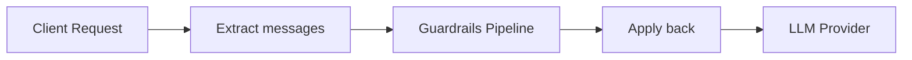

## Overview

Guardrails are a pipeline of rules that run **before** a request reaches any LLM provider. They can inspect, modify, or reject requests — giving you centralized control over every prompt that flows through GOModel.

Guardrails work across all text-based endpoints:

- `/v1/chat/completions`
- `/v1/responses`

<Note>
  Guardrails for images, TTS, STT, and video models are planned as a separate
  system and are not covered here.
</Note>

## Quick Start

Add a `guardrails` section to your `config/config.yaml`:

```yaml
guardrails:
  enabled: true
  rules:
    - name: "safety-prompt"
      type: "system_prompt"
      order: 0
      system_prompt:
        mode: "decorator"
        content: "Always respond safely and respectfully."
```

That's it. Every request now gets the safety prompt prepended to its system instructions.

## How It Works

{/* Client Request → Extract messages → Guardrails Pipeline (order 0 → order 1 → ...) → Apply back → LLM Provider */}



1. Messages are **extracted** from the incoming request into a normalized format
2. The guardrails pipeline **processes** the messages (inject, modify, or reject)
3. Modified messages are **applied back** to the original request
4. The request continues to the LLM provider

Guardrails never see the raw API request types — they operate on a normalized message list. This means the same guardrail works identically for `/chat/completions` and `/responses`.

## Execution Order

Each guardrail has an `order` value that controls when it runs:

- **Same order** → run **in parallel** (concurrently)
- **Different order** → run **sequentially** (ascending)

{/* Order 0 (parallel: safety-prompt, content-policy) → Order 1 (compliance-check) → Order 2 (parallel: final-filter, audit-tag) → done */}

```mermaid
flowchart LR
    subgraph Order 0
        A[safety-prompt]
        B[content-policy]
    end
    subgraph Order 1
        C[compliance-check]
    end
    subgraph Order 2
        D[final-filter]
        E[audit-tag]
    end
    Order 0 --> Order 1 --> Order 2
```

Each sequential group receives the output of the previous group. If any guardrail returns an error, the request is **rejected** and never reaches the provider.

## Configuration

### Full Structure

```yaml
guardrails:
  enabled: true    # Master switch (default: false)
  rules:
    - name: "rule-name"         # Unique identifier for this instance
      type: "system_prompt"     # Guardrail type
      order: 0                  # Execution order
      system_prompt:            # Type-specific settings
        mode: "decorator"
        content: "Your prompt text here."
```

### Environment Variable

You can toggle guardrails without editing the config file:

```bash
export GUARDRAILS_ENABLED=true
```

### Rule Fields

| Field  | Required | Description                                                         |
| ------ | -------- | ------------------------------------------------------------------- |
| `name` | Yes      | Human-readable identifier. Supports spaces and unicode.             |
| `type` | Yes      | Guardrail type (currently: `system_prompt`).                        |
| `order`| No       | Execution order. Default `0`. Same value = parallel, different = sequential. |

## Guardrail Types

### `system_prompt`

Adds, replaces, or decorates the system prompt on every request.

#### Settings

| Field     | Required | Description                                    |
| --------- | -------- | ---------------------------------------------- |
| `mode`    | No       | `inject`, `override`, or `decorator`. Default: `inject`. |
| `content` | Yes      | The system prompt text to apply.               |

#### Modes

<Tabs>
  <Tab title="inject">
    Adds a system message **only if none exists**. Existing system prompts are left untouched.

    ```yaml
    - name: "default-system"
      type: "system_prompt"
      order: 0
      system_prompt:
        mode: "inject"
        content: "You are a helpful assistant."
    ```

    **Behavior:**
    - Request has no system prompt → adds one
    - Request already has a system prompt → no change
  </Tab>
  <Tab title="override">
    **Replaces** all existing system messages with the configured content.

    ```yaml
    - name: "strict-system"
      type: "system_prompt"
      order: 0
      system_prompt:
        mode: "override"
        content: "You are a compliance-focused assistant. Follow all company policies."
    ```

    **Behavior:**
    - Any existing system prompts are removed
    - A single new system prompt is set
  </Tab>
  <Tab title="decorator">
    **Prepends** the configured content to the existing system prompt (separated by a newline). If no system prompt exists, adds one.

    ```yaml
    - name: "safety-prefix"
      type: "system_prompt"
      order: 0
      system_prompt:
        mode: "decorator"
        content: "Always respond safely and respectfully."
    ```

    **Behavior:**
    - Existing system prompt `"You are a coding assistant."` becomes:
      ```
      Always respond safely and respectfully.
      You are a coding assistant.
      ```
    - No system prompt → creates one with just the configured content
  </Tab>
</Tabs>

## Examples

### Single Safety Guardrail

The simplest setup — add a safety prefix to every request:

```yaml
guardrails:
  enabled: true
  rules:
    - name: "safety"
      type: "system_prompt"
      order: 0
      system_prompt:
        mode: "decorator"
        content: "Always be safe, respectful, and helpful."
```

### Multiple Guardrails in Parallel

Two guardrails running at the same order execute concurrently:

```yaml
guardrails:
  enabled: true
  rules:
    - name: "safety-prompt"
      type: "system_prompt"
      order: 0
      system_prompt:
        mode: "decorator"
        content: "Always be safe and respectful."

    - name: "compliance-prompt"
      type: "system_prompt"
      order: 0
      system_prompt:
        mode: "inject"
        content: "Follow all company compliance policies."
```

### Sequential Pipeline

Guardrails with different orders run one after another. Later groups see the output of earlier ones:

```yaml
guardrails:
  enabled: true
  rules:
    # Step 1: ensure a system prompt exists
    - name: "default-system"
      type: "system_prompt"
      order: 0
      system_prompt:
        mode: "inject"
        content: "You are a helpful assistant."

    # Step 2: decorate whatever system prompt is now present
    - name: "safety-prefix"
      type: "system_prompt"
      order: 1
      system_prompt:
        mode: "decorator"
        content: "[SAFETY] Always respond within company guidelines."
```

### Mixed Parallel and Sequential

```yaml
guardrails:
  enabled: true
  rules:
    # Order 0: these two run in parallel
    - name: "safety"
      type: "system_prompt"
      order: 0
      system_prompt:
        mode: "decorator"
        content: "Be safe."

    - name: "policy"
      type: "system_prompt"
      order: 0
      system_prompt:
        mode: "inject"
        content: "Follow company policy."

    # Order 1: runs after both order-0 guardrails complete
    - name: "final-override"
      type: "system_prompt"
      order: 1
      system_prompt:
        mode: "decorator"
        content: "[FINAL CHECK]"
```

## How It Works With Different Endpoints

Guardrails operate on a normalized message format internally. The adaptation between API-specific request types and this format happens automatically:

| Endpoint              | System prompt source     | User messages source |
| --------------------- | ------------------------ | -------------------- |
| `/v1/chat/completions`| `messages` with `role: "system"` | `messages` array     |
| `/v1/responses`       | `instructions` field     | `input` field        |

<Tip>
  You don't need to think about which endpoint your users call. A single
  guardrail rule works identically for both.
</Tip>

## Errors and Rejection

If a guardrail returns an error, the request is rejected immediately. The error is returned to the client and the request **never reaches** the LLM provider.

This is useful for future guardrail types that validate content (e.g., PII detection, content filtering). The system prompt guardrail does not reject requests — it only modifies them.
