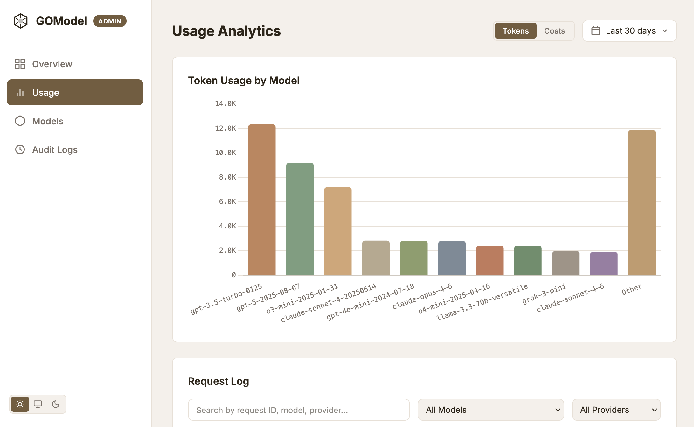
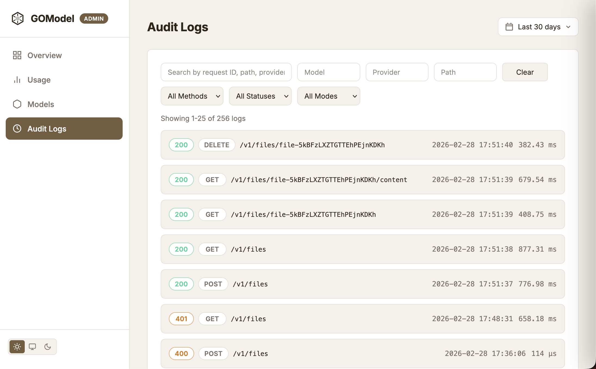

## Run GOModel in 30 Seconds

GOModel is an OpenAI-compatible AI gateway. You can connect one endpoint and
route traffic across multiple LLM providers while keeping auth, audit logs, and
admin visibility in one place.

### 1. Start GOModel

```bash
docker run --rm -p 8080:8080 \
  -e GOMODEL_MASTER_KEY="change-me" \
  -e OPENAI_API_KEY="sk-..." \
  enterpilot/gomodel
```

<Note>
  Set at least one provider credential (`OPENAI_API_KEY`, `ANTHROPIC_API_KEY`,
  `GEMINI_API_KEY`, etc.) or GOModel will have no models to route.
</Note>

### 2. Send your first request

```bash
curl http://localhost:8080/v1/chat/completions \
  -H "Content-Type: application/json" \
  -H "Authorization: Bearer change-me" \
  -d '{
    "model": "gpt-4o-mini",
    "messages": [{"role": "user", "content": "Say hello in one sentence."}]
  }'
```

### 3. Open the Admin Panel

Open this URL in your browser:

`http://localhost:8080/admin/dashboard`

<Tip>
  Dashboard UI is enabled by default (`ADMIN_UI_ENABLED=true`). Admin API
  endpoints are at `/admin/api/v1/*` and use the same bearer auth as the main
  API.
</Tip>

## Verify Models

List currently available models:

```bash
curl -s http://localhost:8080/v1/models \
  -H "Authorization: Bearer change-me"
```

Use one of those model IDs in your requests.

## Admin Panel Preview

### Usage Analytics



### Audit Logs



## Next Steps

- Configure production settings: [Configuration](/advanced/configuration)
- Add request policies: [Guardrails](/advanced/guardrails)
- Connect OpenClaw: [Using GOModel with OpenClaw](/guides/openclaw)
